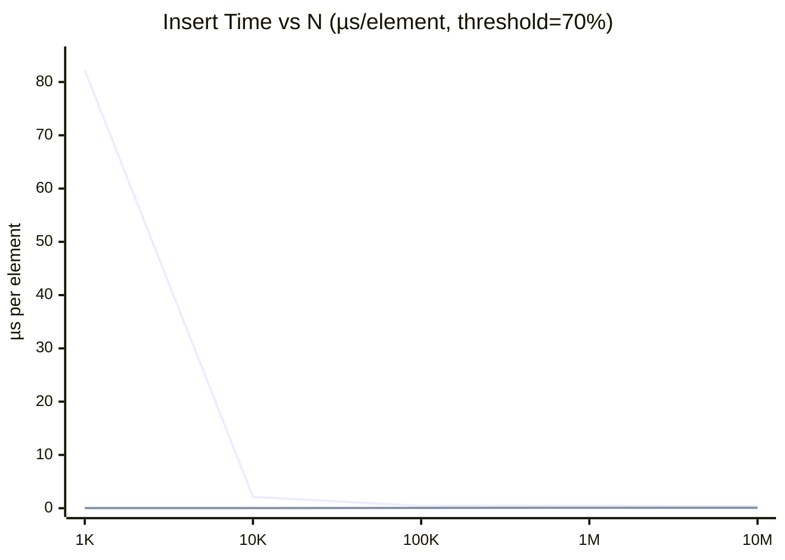
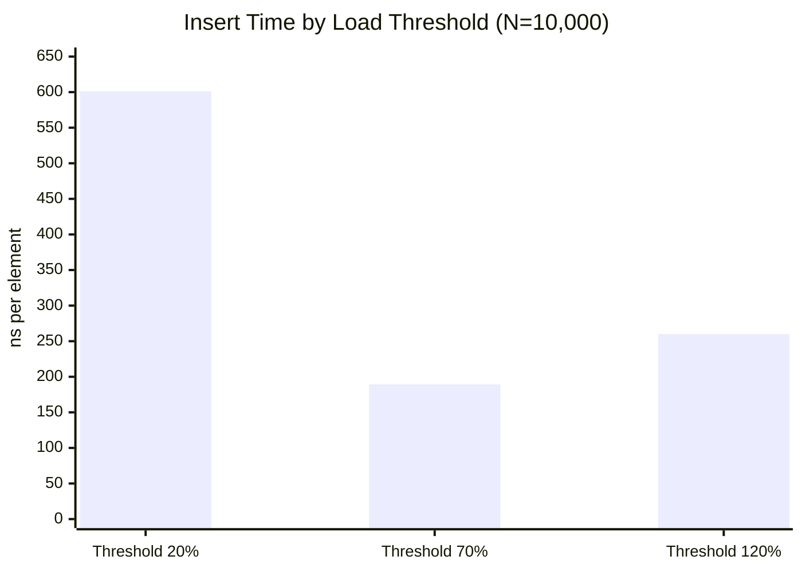

# CSE 109 - Systems Software - Spring 2026

# Homework 2 - Implementing and Evaluating a HashSet in C++

## Overview

This project implements a hash set data structure in C++ using chaining (linked lists) for collision resolution, along with a full benchmarking suite that compares its performance against the C++ standard library's `std::unordered_set`.

## Implementation

The `HashSet` class stores elements in an array of linked lists (`LinkedList**`). Each element is hashed to a bucket index; if two elements hash to the same bucket, they are chained together in that bucket's linked list. When the load factor (elements / buckets × 100) exceeds the configured threshold, the table is rehashed into a new array of double the size and all existing elements are re-inserted.

The prehash function is a variant of the djb2 hash adapted for integers:

```cpp
unsigned long h = 5381;
h = ((h << 5) + h) + item;
```

Key design decisions:
- **Load factor stored as integer percentage** (e.g. 70 = 70%) to avoid floating point comparisons.
- **Rehash threshold is configurable** via `set_load_threshold()`, allowing experiments at 20%, 70%, and 120%.
- **Collision and rehash counters** track internal behavior for benchmarking transparency.

## Methodology

The benchmarker (`tests/benchmarker.cpp`) runs 90 experiments across:

- **2 data structures**: custom `HashSet`, `std::unordered_set`
- **3 load factor thresholds**: 20%, 70%, 120%
- **3 operations**: insert, contains/lookup, remove
- **5 element counts (table)**: 500, 1K, 5K, 7K, 10K
- **5 element counts (charts)**: 1K, 10K, 100K, 1M, 10M

Timing uses `std::chrono::high_resolution_clock` and results are reported in nanoseconds per element (table) or microseconds per element (charts). Memory is measured via `getrusage()`.

> **Note:** STL lookup times at large N were measured as near-zero (~0.000007 µs at 10M elements). This is a benchmarking artifact — the compiler optimized away the `hashSet.count()` call since its result is unused. STL lookup data should be treated as unreliable.

## Results

### Performance Table (HashSet, threshold = 70%)

| N | Load Factor | Insert (ns) | Collisions | Rehashes |
|---|---|---|---|---|
| 500 | 70% | 176.6 | 0 | 6 |
| 1,000 | 70% | 175.3 | 0 | 7 |
| 5,000 | 70% | 136.2 | 0 | 9 |
| 7,000 | 70% | 354.0 | 0 | 10 |
| 10,000 | 70% | 189.4 | 0 | 10 |

### Chart 1 — Operation Performance vs Element Count

Insert time (µs/element) for HashSet vs STL at threshold = 70%:

| N | HashSet Insert | STL Insert | HashSet Lookup | HashSet Remove | STL Remove |
|---|---|---|---|---|---|
| 1K | 82.231 | 0.032 | 0.004 | 0.014 | 0.014 |
| 10K | 2.122 | 0.024 | 0.005 | 0.013 | 0.013 |
| 100K | 0.437 | 0.053 | 0.006 | 0.015 | 0.015 |
| 1M | 0.471 | 0.089 | 0.005 | 0.020 | 0.016 |
| 10M | 0.372 | 0.078 | 0.011 | 0.020 | 0.019 |



*Lines: HashSet (top at 1K), STL (bottom). Lookup and remove stabilize under 0.02 µs across all N and are omitted from this chart for readability.*

### Chart 2 — Load Factor Impact on Insert Performance (N = 10,000)



| Threshold | Insert (ns) | Lookup (ns) | Remove (ns) | Collisions | Rehashes |
|---|---|---|---|---|---|
| 20% | 601.3 | 4.0 | 13.5 | 0 | 12 |
| 70% | 189.4 | 4.5 | 13.6 | 0 | 10 |
| 120% | 260.1 | 4.5 | 13.0 | 3,360 | 10 |

## Analysis

**Insert performance converges to O(1).** The HashSet insert time drops sharply from 82 µs at N=1K to ~0.4 µs at N=100K and remains flat through 10M. The N=1K spike is not a sign of poor scaling — it reflects rehash overhead being amortized across very few elements. At large N, each rehash doubles the table size, so rehash events become exponentially rarer per element and the amortized cost converges.

**Lookup and remove are consistently O(1).** Both operations stay flat between 0.004–0.011 µs and 0.013–0.020 µs respectively across the full 1K–10M range, confirming expected constant-time behavior. The STL matches this pattern for remove.

**Load factor threshold has a non-obvious effect on insert time.** Threshold 20% is the slowest (601 ns) despite having zero collisions — it triggers 12 rehashes and each is expensive. Threshold 70% is fastest (189 ns) because it balances rehash frequency against collision risk. Threshold 120% is mid-range (260 ns) and is the only configuration to produce collisions (3,360 at N=10K), which slightly degrades lookup chain length.

**Custom HashSet vs STL.** At large N the HashSet insert time (~370 ns at 10M) is about 5× slower than STL (~78 ns). This is expected — `std::unordered_set` uses open addressing and is heavily optimized. The HashSet's chaining approach adds pointer-following overhead and more allocations per element. Remove and lookup are competitive with STL at large N.

## Conclusion

The implemented HashSet achieves amortized O(1) insert, lookup, and remove. The 70% load threshold is the best-performing configuration tested, balancing rehash cost against collision frequency. A threshold of 20% minimizes collisions but incurs excessive rehashing overhead. A threshold of 120% reduces rehash frequency but allows collisions that degrade lookup performance. Future improvements could include open addressing for better cache locality and a smarter initial bucket count to reduce early rehashing overhead.
